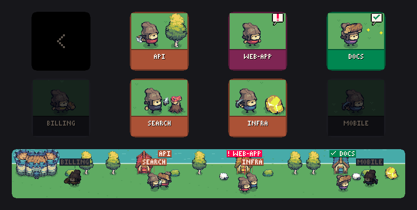
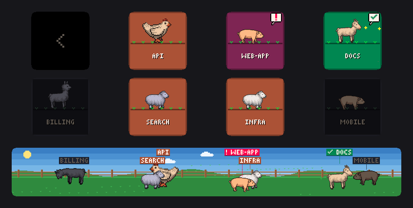

<h1 align="center">Corral</h1>

<p align="center">
  <b>Your coding agents as a herd of pixel-art critters on a Stream Deck +.</b><br>
  See who's working, who needs you and who's done at a glance. Tap one to jump straight to it.
</p>

<p align="center">
  
</p>

<p align="center">
  
  
  
  
</p>

---

Each agent from [herdr](https://herdr.dev) becomes a little character that keeps the same look for its workspace, so
you know who's who without reading. Every key is one agent. The touch strip shows the whole herd together, each critter
standing right under its key.

| | What you see |
|---|---|
| 🟤 **Working** | Busy: walking, chopping wood, mining, hammering |
| 🔴 **Needs you** | Hopping with a blinking **!** bubble, front and centre |
| 🟢 **Done** | Showing off its work with a **✓** and sparkles |
| ⚫ **Idle** | Dimmed and resting, so it stays out of the way |

Agents that need you come first, then finished ones, then working, then idle.

## Themes

Turn the last dial to switch. Your choice is remembered.

### Kingdom

Every workspace gets a pawn with a job (lumberjack, miner, builder or butcher) and a team colour. Working pawns haul
wood, gold and meat back to the castle, and the island changes with the time of day.


### Farm

Goats, sheep, cows, pigs, llamas and chickens grazing in a field, under a sky that follows your clock, with stars at
night.



Want to make one? See **[Adding a theme](docs/adding-a-theme.md)**. It's one file, and there's a working template to
start from.

## Controls

| | |
|---|---|
| **Press a key** | Focus that agent in herdr and bring the terminal forward |
| **Tap the touch strip** | Focus the critter you tapped |
| **Push any dial** | Jump to the agent that needs you most |
| **Turn dials 1–3** | Page through agents when there are more than keys |
| **Turn dial 4** | Switch theme |

## Install

You need:

- a Stream Deck + and the Stream Deck app, on macOS;
- [herdr](https://herdr.dev);
- [Ghostty](https://ghostty.org);
- [Bun](https://bun.sh).

Then build the plugin and register it with the Stream Deck app:

```sh
git clone https://github.com/fedeya/corral
cd corral
bun install
bun run build
bun run link
```

In the Stream Deck app, open the **Corral** category. Drag **Agent slot** onto every key you want to use, and
**Agents strip** onto all four dials.

> [!NOTE]
> The herdr path (`/opt/homebrew/bin/herdr`) and the terminal (Ghostty) are hard-coded in `src/herdr.ts` for now.

### Enabling the kingdom theme

The kingdom art can't be redistributed, so it isn't in the repo:

1. Download [Tiny Swords](https://pixelfrog-assets.itch.io/tiny-swords) by Pixel Frog. It's free.
2. Copy the sprites into `dev.fedeya.corral.sdPlugin/imgs/kingdom/`: pawns for each team colour, trees, castle, houses,
   gold stone, bushes, sheep, stump, meat and wood. The exact file names are in `src/themes/kingdom.ts`.

The theme appears as soon as the files are there.

## Development

| Command | |
|---|---|
| `bun run build` | Bundle the plugin |
| `bun run restart` | Reload it in the Stream Deck app (needs `streamdeck dev`) |
| `bun run preview <theme> --open` | Render keys and touch strip to a PNG, no device needed |
| `bun run media` | Re-render the GIFs in `docs/media/` |
| `bun run demo on` / `off` | Pretend agents in a separate herdr session, for recordings (see below) |
| `bun run typecheck` | Type-check |

The plugin polls `herdr agent list` every second and focuses agents with `herdr agent focus`. Logs go to
`dev.fedeya.corral.sdPlugin/logs/`.

### Demo mode

`bun run demo on` starts a separate herdr session, `corral-demo`, with pretend agents that look like a coding agent at
work. They follow a script (`scripts/demo-story.ts`): they start working, some finish, some stop and ask you to confirm
(press `1`). The plugin switches to that session, so tapping a key opens the pretend agent. Your real herdr session isn't
touched.

Open the demo in Ghostty with `herdr --session corral-demo`. Run `bun run demo on` again to restart the story, and
`bun run demo off` when you're done.

## Credits

- **Farm:** [LPC farm animals](https://opengameart.org/content/lpc-style-farm-animals) by Daniel Eddeland and
  [LPC Goat](https://opengameart.org/content/lpc-goat) by bluecarrot16, CC-BY 3.0.
- **Kingdom:** [Tiny Swords](https://pixelfrog-assets.itch.io/tiny-swords) by Pixel Frog. Not included in the repo.
- **Code:** [MIT](LICENSE).
